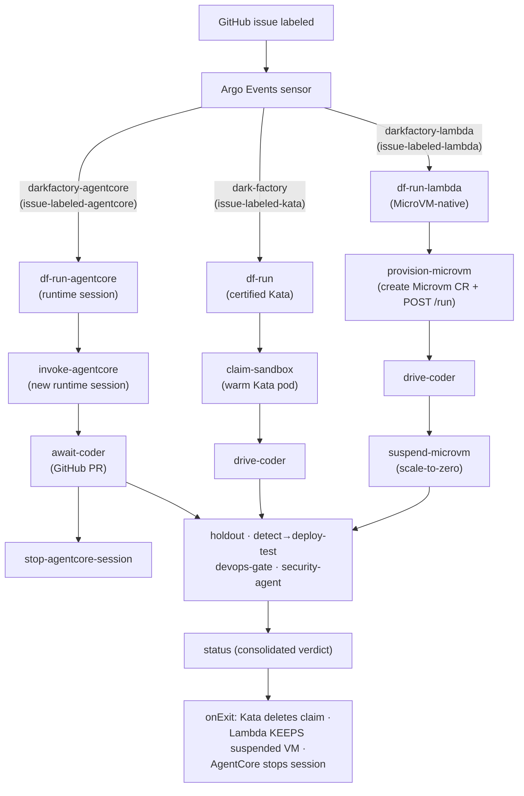
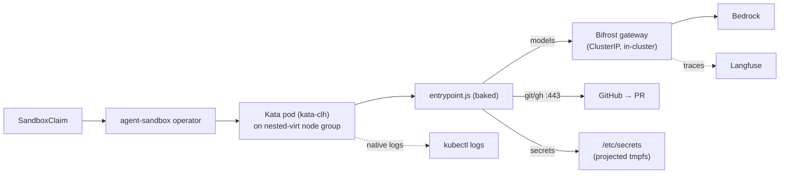
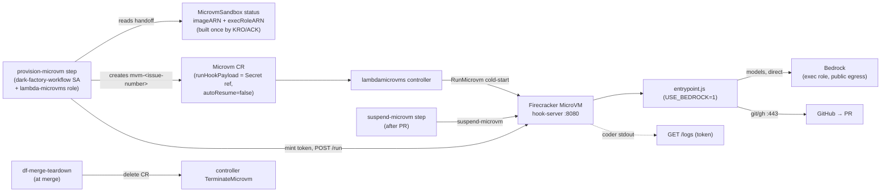
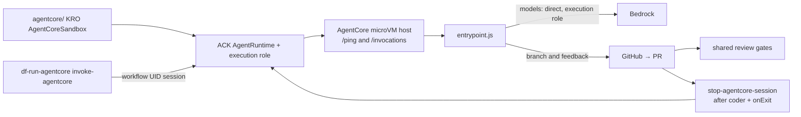
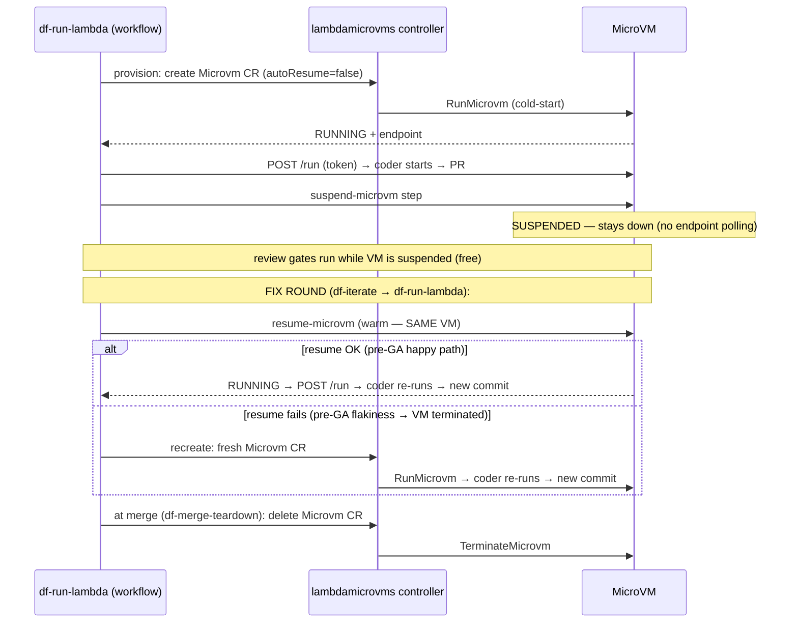
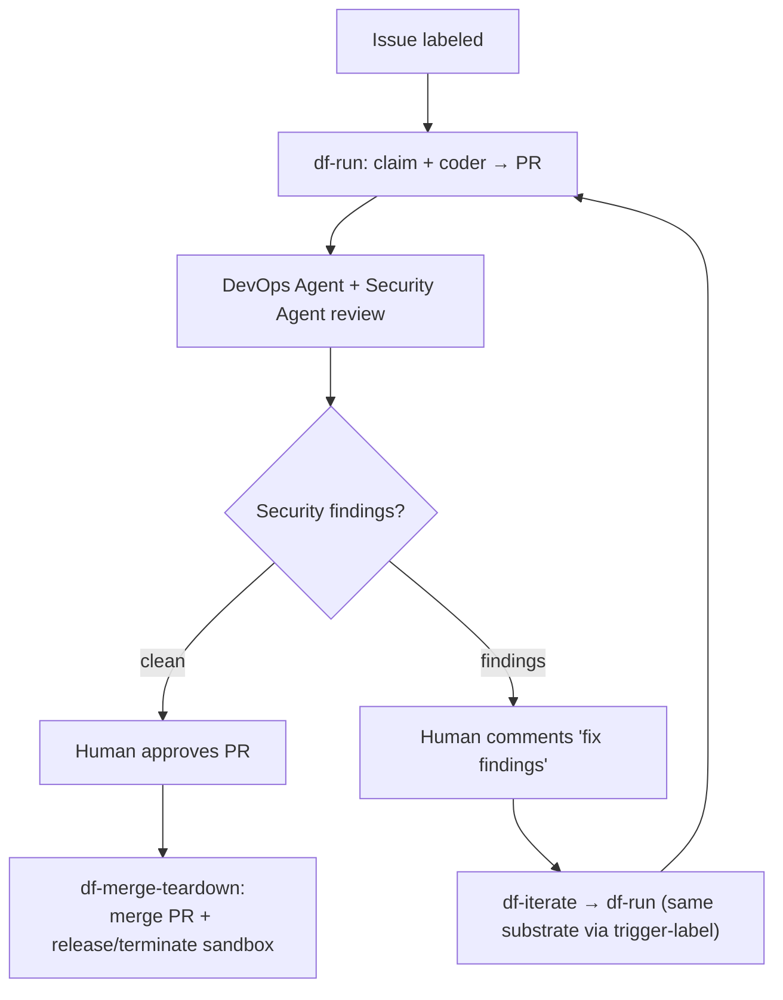

# Dark Factory — Substrate Diagrams (Kata, Lambda MicroVM, AgentCore Runtime)

Visual companion to [`SUBSTRATES.md`](./SUBSTRATES.md). All diagrams are
Mermaid (render on GitHub).

---

## 1. Label-routed to three SEPARATE WorkflowTemplates

The Argo Events sensor routes each label to a **different** WorkflowTemplate, so Kata's certified
pipeline is never touched by Lambda MicroVM substrate. Kata keeps its SandboxClaim; Lambda provisions a MicroVM directly.

The Kata graph has **zero MicroVM nodes**. `suspend-microvm` is explicit and lives only in
`df-run-lambda`; suspend/resume is driven by the workflow itself (§4), not a bridge or controller.

---

## 2. Kata micro-VM substrate (Kata substrate)

- Pre-warmed pod → **instant claim**.
- Workspace is a **mounted writable volume**; logs are native; models via Bifrost (with Langfuse
  traces). Node pool runs continuously.

---

## 3. Lambda MicroVM substrate (Lambda MicroVM substrate) — MicroVM-native, no bridge

- One workflow **step** (`provision-microvm`) does create + drive `/run` — **no bridge pod, no
  SandboxClaim, no warm pool**. `RunMicrovm` cold-start per session (~90s); no node pool.
- No cluster network dependency — **Bedrock-direct**. Logs via `/logs`. The explicit
  `suspend-microvm` step suspends after the PR; the VM stays suspended (autoResume=false) until a fix
  round resumes it or merge terminates it.

---

## 3b. AgentCore Runtime substrate — disposable sessions

The host reports `HealthyBusy` while the coder runs. A new round starts a new
session; GitHub holds the branch and feedback. `PUBLIC` is the default network
mode; `VPC` uses private subnets and the Terraform egress security group. V2
restores an idle snapshot for each session. See the
[verified scope](./SUBSTRATES.md).

---

## 4. Lambda suspend / resume (workflow-driven; warm resume + recreate-fallback)

The CR is named `mvm-<issue-number>` (stable across rounds) → exactly one VM per issue, so
suspend/resume never flap between competing owners.

---

## 5. End-to-end lifecycle (issue → PR → fix → merge) — all three substrates

The loop is the same for all three; `df-iterate` reads the originating issue's label to
route the fix round back to the **same** substrate (Kata pool, Lambda MicroVM, or AgentCore Runtime).

---

## Legend / key facts

- **Warm pool:** Kata = ready pods (instant); Lambda and AgentCore launch remote compute without a warm pool.
- **LLM:** Kata → Bifrost (traced in Langfuse); Lambda → Bedrock-direct (exec role).
- **Workspace:** Kata → mounted volume; Lambda → `/tmp/workspace` (read-only rootfs).
- **Logs:** Kata → `kubectl logs`; Lambda → `/logs` endpoint (+ build logs in CloudWatch).
- **Teardown:** Kata → release claim; Lambda → delete `Microvm` CR → TerminateMicrovm.
- **AgentCore:** no warm pool or suspended workspace; each round invokes and stops
  a fresh session, with CloudWatch runtime logs and Bedrock-direct inference.
